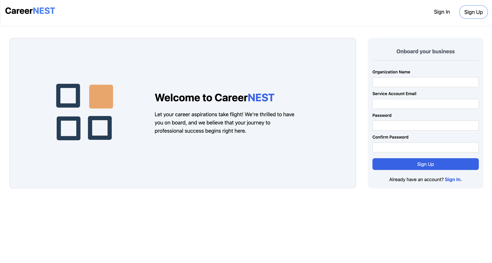
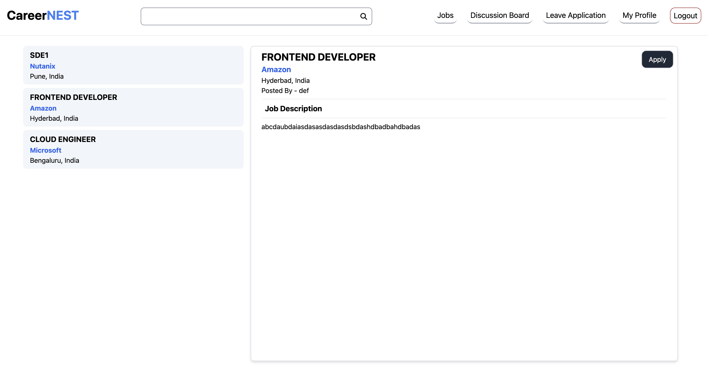

## CareerNEST - Multi-Tenant Employee Management SAAS Application

| Signin/Signup                  | Employee Home/Jobs             |
| ------------------------------ | ------------------------------ |
|  |  |

## Problem Statement

### Q1. Load balancing and Auto scaling. In this problem, implement a system for the following requirements.

- Provide at least 5 services in any domain like education, healthcare, etc.
- Should support multiple tenants. Each tenant is identified by email. A tenant can select one
  or more services from the predefined menu and deploy them. While deploying, tenant can
  enable auto-scaling option for each service separately.
- Services are hosted in containers. Load balancer will distribute the requests of a single service
  among the instances. Autoscaler will adjust instances every 10 seconds.
- Minimum instances for autoscaler is 2 containers. Instances can be increased up to maximum
  of 10. Every 10 seconds autocaler makes decision whether to increase/decrease/keep as is
  the number of instances. Autoscaler should support any two of the methods {threshold-based
  rules, reinforcement learning, queueing theory, control theory, time series analysis} and
  tenant can choose which one to use.
- Load balancer should support methods for traffic distribution: random, power of two choices,
  weighted round-robin, weighted least connected, IP hash. Tenant can choose which one to
  use.
- Your setup should be tested with service request traffic generated using automated tools
  such as https://packetsender.com/

### Q2. In this problem, cloud based object storage system is to be implemented.

- Data (set of objects) is partitioned and stored using consistent hashing on a ring topology of
  2
  64 id space. Number of nodes (Containers/VMs) should be at least 3 and each representing
  500 virtual nodes.
- Each object is replicated in N nodes (N is configurable). Consistency among replicas is
  achieved by using vector clocks, read-write quorums, and rea-repair and anti-entropy process.
  Dynamo paper
- Every t seconds (t is configurable), system should check for hotspots and migrate
  VM/container using volume-to-size ratio. Reference
- REST API for user to be able to create/delete objects.
- The API should return the following in a JSON object: Success or failure, Vector clocks of
  all replicas, Node number where the write took place (in case of write)

## Technology stack 🔥->

- React JS
- Typescript/javascript
- Tailwind CSS
- Node JS, Express
- AWS RDS (Postgres)
- Nginx (optional config is present)
- REST API Microservices
- Docker Swarm

## Key Features 🌟->

- **Multi-Tenant Employee Management SAAS**:
  - Developed a scalable and highly available SAAS solution for employee management, supporting multiple organizations with distinct configurations.
- **Dynamic Service Deployment:**
  - Introduced a flexible service deployment feature allowing organizations to configure load-balancing methods and enable auto-scaling, accommodating up to 10 instances per service.
- **Comprehensive Modules:**
  - Provide tenant-specific modules for employee onboarding, job posting, discussion forums, leave applications, job applications, and profile management, streamlining employee management portal within a secure and customizable environment.

## Setup guide to run this project in local machine 🚀->

- **Git Clone the project to your local directory with the following command**:
  - `git clone https://github.com/Debraj550/CareerNEST-SAAS.git`
- **Install Docker Desktop if you dont have it installed from the following link**:
  - `https://docs.docker.com/engine/install/`
- **Go inside the project directory in your local machine (where client, server and docker-compose.yml file is present) and run the following commands in terminal:**
  - `docker swarm init`
  - `docker stack deploy -c docker-compose.yml careernest` (you can replace the "carrernest" name with any name of your choice)
  - (Optional - To stop the project and remove the services) `docker swarm leave --force`
- **Go to browser and open [http://localhost:3000].**

## Ports

- Tenant-Management-Service (Port: 8001)
- Employee-onboarding-service (Port: 8001)
- Job-Posts-Service (Port: 8003)
- Job-Application Service (Port: 8004)
- Leave-application-service (Port: 8005)
- Discussion-forum-service (Port: 8006)

## Docker Commands ->

- Create and Image from Docker File: `dokcer built -t <image_name>:tag .`
- Docker compose up and down: `docker compose up -d ` or `docker compose down`
- Swarm Initialization: `docker swarm init`
- Deploy stack of docker compose in swarm manager node: `docker stack deploy -c docker-compose.yml <stack_name>`
