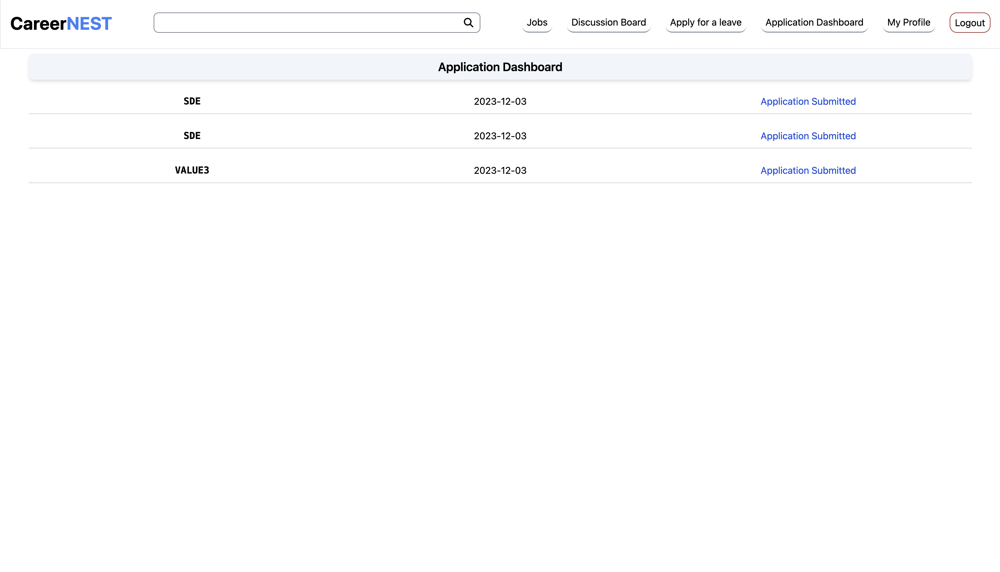

## CareerNEST - A multi-tenant based distributed employee Management application

- This application operates on a multi-tenant architecture, where each organizational entity serves as a distinct tenant.
- Its primary focus is the efficient management of distributed employee-related processes.
- The differentiation between tenants is established by the unique identity of each organization, ensuring segregated and secure handling of their respective data within the system.

## Tech Stack 🔥->

- React JS
- Typescript/javascript
- Tailwind CSS
- Node JS, Express
- Postgres / AWS RDS Postgres
- Nginx (optional config is present)
- REST API Microservices
- Docker

## Image Samples

| Welcome Page                   |
| ------------------------------ |
|  |

| Home Page (Employee)           | Application Dashboard          |
| ------------------------------ | ------------------------------ |
|  |  |

## Key Features 🌟->

- **Multi-Tenant Employee Management SAAS**:
  - Developed a scalable and highly available SAAS solution for employee management, supporting multiple organizations with distinct configurations.
- **Dynamic Service Deployment:**
  - Introduced a flexible service deployment feature allowing organizations to configure load-balancing methods and enable auto-scaling, accommodating up to 10 instances per service.
- **Comprehensive Modules:**
  - Provide tenant-specific modules for employee onboarding, job posting, discussion forums, leave applications, job applications, and profile management, streamlining employee management portal within a secure and customizable environment.

## Setup guide to run this project in local machine 🚀->

- **Git Clone the project to your local directory with the following command**:
  - `git clone https://github.com/Debraj550/CareerNEST-SAAS.git`
- **Install Docker Desktop if you dont have it installed from the following link**:
  - `https://docs.docker.com/engine/install/`
- **Go inside the project directory in your local machine (where client, server and docker-compose.yml file is present) and run the following commands in terminal:**
  - `docker swarm init`
  - `docker stack deploy -c docker-compose.yml cloud_project` (you can replace the "carrernest" name with any name of your choice)
  - (Optional - To stop the project and remove the services) `docker swarm leave --force`
- **Go to browser and open [http://localhost:3000].**

## Ports

- Master Load Balancer Service (Port: 8080)
- Tenant-Management-Service (Port: 8001)
- Employee-onboarding-service (Port: 8002)
- Job-Posts-Service (Port: 8003)
- Job-Application Service (Port: 8004)
- Leave-application-service (Port: 8005)
- Discussion-forum-service (Port: 8006)

## Essential Docker Commands ->

- Create and Image from Docker File: `dokcer built -t <image_name>:tag .`
- Docker compose up and down: `docker compose up -d ` or `docker compose down`
- Swarm Initialization: `docker swarm init`
- Deploy stack of docker compose in swarm manager node: `docker stack deploy -c docker-compose.yml <stack_name>`
